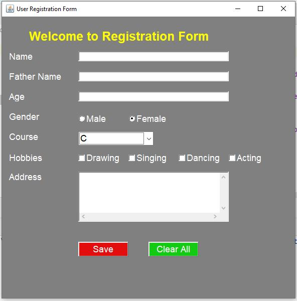

# 🌟 Java AWT Registration Form

This project is a simple User Registration Form developed using Java's Abstract Window Toolkit (AWT). It includes various form fields like name, age, gender, and hobbies, along with a "Save" and "Clear" button. The graphical user interface (GUI) is built using AWT components such as Labels, TextFields, Checkboxes, and Buttons.

## 🚀 Features
- 📋 Input fields for user details (Name, Father's Name, Age, Address)
- 👨‍👩‍👧‍👦 Gender selection using radio buttons (Male, Female)
- 🎓 Course selection using dropdown menu
- 🎨 Multiple hobbies selection using checkboxes
- 💾 Buttons for saving the form and clearing all inputs
- ❌ Basic error handling for window closing

## 🖼️ Screenshot

